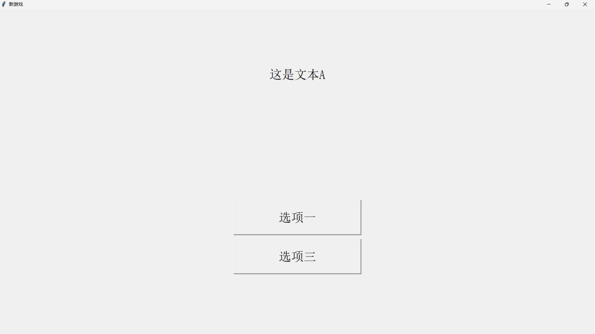
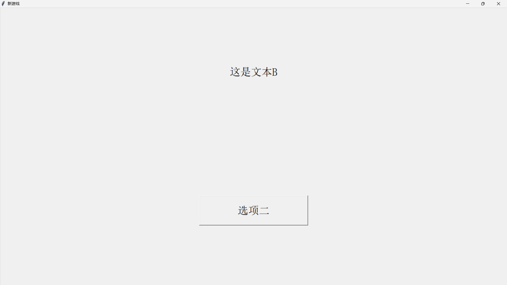

## 简介

Alice Engine(v0.1)是一个文字游戏引擎，旨在让游戏开发者简便地开发属于自己的文字游戏。引擎使用 python 语言开发，操作简单，新手可轻松上手。

## 使用方式

Alice Engine 引擎运行的基本单位是节点(Point)，节点分属着各自的选项(Choice)，选项再链接到各自的节点。<br>
当游戏开始时，游戏画面会显示此时的节点文本，下面会列出一系列选项。当玩家点击一个选项后，游戏会跳转到选项所对应的节点。

### 1. 节点

引擎使用如下的语法定义一个节点：

```as
{
    节点文本
    #选项一...
    #选项二...
    #...
}
```

其中，换行和缩进是可选的，合适的换行和缩进可以让脚本文件更具可读性。

#### 在节点中添加Python代码
你可以在脚本的节点添加 python 代码，当游戏来到一节点时，其相应的代码会被执行。<br>
python 代码用一对`@`括起来

下面为调用示例：
```as
@a = 3@
```
在 python 代码调用中，你可以定义和调用变量，还可以调用部分 python 内置函数(注意：为了游戏运行的安全性和稳定性，部分 python 内置函数将被屏蔽从而避免被调用)<br>
此外，你还可以通过使用`@api.func()@`格式调用引擎提供的接口库 api，来调用引擎的接口函数。

### 2. 选项

选项的语法为：

```
#选项名
{
    对应的节点...
}
```

### 3. 转义字符

转义字符是如同`$a`、`$n`等的字符串，用以替代一些字符，从而能被解释器正常解释。解释前，它们将被转换为其原本的字符。<br>
如果你的游戏文本中含有`{`、`}`和`#`等脚本语言的保留字符，请用转义字符替代它们，以免被脚本文件解释器错误解释。<br>
此外，如果你的游戏文本中含有空格键、换行符等，我们同样推荐你使用转义字符替代它们，从而降低脚本文件解释器出现错误的概率。

现有的转义字符如下：

> `$n` : 换行符 <br> > `$s` : 空格 <br> > `$t` : 制表符(`\t`) <br> > `$p` : 井号 <br> > `$l` : 左大括号 <br> > `$r` : 右大括号 <br> > `$b` : 回车(`\r`) <br> > `$k` : 斜杠(`/`) <br>

<br>
目前共有两个接口函数：echo 和 create_gui。echo(text)的功能和 python 内置函数 print 类似，其将接受一个字符串参数，并在控制台打印出来；而 create_gui()函数则会创建并返回一个新的 GUI 对象。

### 4. 注释

你还可以在脚本中添加注释，以提高代码的可读性和可维护性。<br>
注释以`/*`开始，以`*/`结束。

以下是一个示例注释：

```
/*这是一段注释*/
```

### 5. 游戏名

最后，不要忘记在脚本文件的开头加上游戏名。

设置游戏名的格式为：
```as
游戏名&
```
---
## 示例脚本
我们提供了一个示例脚本 ./script.as

示例脚本文件运行后，效果如下：

点击`选项一`后，会显示：

